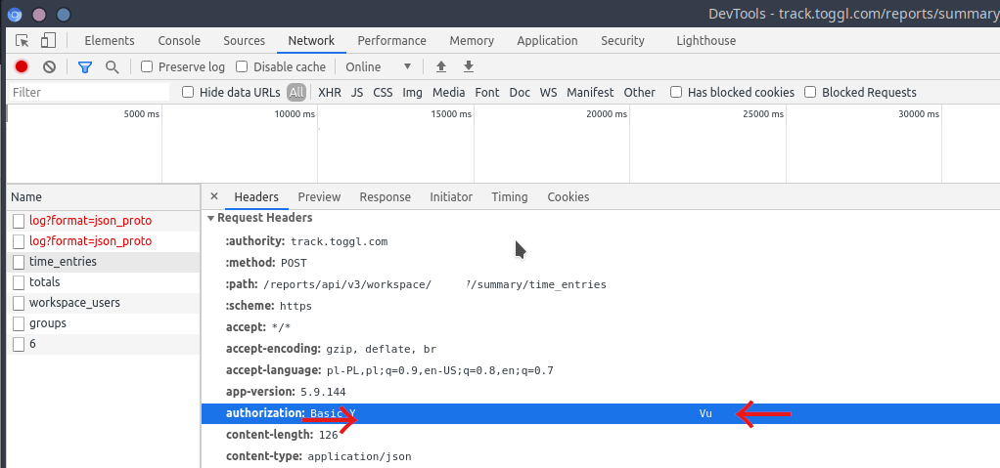

# qje-import

Collections of scripts to import reports from various services and safe it to markdown file.

As for now, there is a possibility to import from:

* [Togll Track](https://toggl.com) - bash scripts qje-importer-toggl

## General concept

* Each importer is independent
* Output from importer is a single MD file per day with suffix after yyy.mm.dd ex. `2021.02.20.toggl.md`
* Some reports can be created only on n day of a week or n day of a month ex. `2021.02.14.toggl-wk06.md` - weekly summary created on Monday (2021-02-15) for the previous day; `2021.02.28.toggl-mth02.md` - monthly summary created on March 1st for the last February
* Files without prefixes (`2021.02.25.md`) are for  journal entries
* Files can have basic frontmatter (title, creation date) used by [Dendron](https://dendron.so)
* Tables in markdown haven't aligned collumns - format document function in vscode is useful for fix that

## Changlelog

### 2021-02-21

* qje-importer-toggl version 0.2.0 - 
  * first published version
  * NEW: daily reports
  * NEW: weekly reports
  * NEW: mass import

## qje-importer-toggl

**version 0.2.0 2021-02-21**

Collections of bash scripts to import reports from [Togll Track](https://toggl.com) and safe it to markdown file as tables.

>Scripts uses both [toggl api v2](https://github.com/toggl/toggl_api_docs/) and api v3 (undocumented) because api v2 does not return Time entries titles.
### Report example

```markdown
# Toggl - 2021-02-20

## Summary

| Project    | Client         | Title     | Duration |
| ---------- | -------------- | --------- | -------- |
| qje        | clientA        | readme.md | 01:07:30 |
| projectB   | clientA        | analisys  | 00:22:38 |
| project123 | Another Client | slacking  | 00:07:29 |


## Details

| Client         | Project    | Description | Start date | Start time | End date   | End time | Duration |
| -------------- | ---------- | ----------- | ---------- | ---------- | ---------- | -------- | -------- |
| clientA        | qje        | readme.md   | 2021-02-20 | 08:28:24   | 2021-02-20 | 10:48:03 | 02:19:39 |
| Another Client | project123 | slacking    | 2021-02-20 | 20:06:32   | 2021-02-20 | 22:00:00 | 01:59:26 |
| clientA        | qje        | readme.md   | 2021-02-20 | 17:40:52   | 2021-02-20 | 19:18:01 | 01:37:09 |
| clientA        | qje        | readme.md   | 2021-02-20 | 10:59:17   | 2021-02-20 | 12:15:42 | 01:16:25 |
…
```

### Configuration

Copy sample configuration file

```bash
cp qje-importer-toggl-config.sh.sample qje-importer-toggl-config.sh
```

Options:

* `API2_TOKEN=abc123zxc` - api token to v2 api - it can be obtained in profile settings <https://track.toggl.com/profile>
* `API3_TOKEN=xyz890abc` - api token to v3 api (not published) - it can be obtained from developer tools in your browser
  * Log into togll
  * open DevTools (Firefox/Chrome) `Ctrl`+`Shift`+`i` on tab Network
  * Go to Toggl reports
  * Copy token from Headers/Request headers/ authorization - just token without *Basic*
    
* `TOGGL_WORKSPACE=12345` - your workspace number - it can be obtained from url go to <https://track.toggl.com/reports> and you will be redirected to <https://track.toggl.com/reports/summary/TOGGL_WORKSPACE>
    
* `TARGET_FILE_DAILY_FORMAT="%Y.%m.%d.toggl.md"` - ex. 2021.02.20.toggl.md
* `TARGET_FILE_WEEKLY_FORMAT="%Y.%m.%d.togglwk%V.md"` - %V is a week number
* `LAST_WEEKDAY=7` - which day of the week treat like the last. 7=Sunday
* `ADD_DENDRON_FRONTMATTER=true` - true/false # add frontmatter used by Dendron
* `WORKING_DIR="../entries/"` - where to save entries and tmp files

### Usage

`qje-importer-toggl/qje-importer-toggl-daily.sh` - generate daily report for **YESTERDAY**

`qje-importer-toggl/qje-importer-toggl-daily.sh YYYY-MM-DD` - generate daily report for YYYY-MM-DD

`qje-importer-toggl/qje-importer-toggl-weekly.sh` - generate weekly report for **YESTERDAY**
 **only if jesterday was the `LAST_WEEKDAY`**

 `qje-importer-toggl/qje-importer-toggl-weekly.sh YYYY-MM-DD` - generate weekly report for 2021-02-01
 **only if YYYY-MM-DD was the `LAST_WEEKDAY`**

 `qje-importer-toggl-mass.sh YYYY-MM-DD YYYY-MM-DD` - generate of all daily and weekly reports for days between two dates (including these dates)

### Temporary files

`tmpd`, `tmps` and `tmpw` files are created in `WORKING_DIR`. They are overwritten but not deleted.
Target files are not overwritten.

### Debugging

Uncomment `cat tmpw` in daily and weekly script and remowe `-s` option in `curl`
